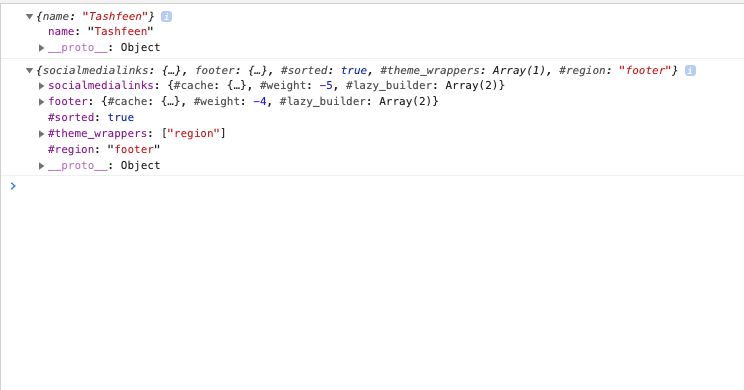

# Drupal 8 Console Debugger

#### Nice way to debug drupal variables inside Twig Templates and PHP.

Drupal has some really cool extesions to dump everything to the page but sometimes it becomes harder to find a variable 
and debug it. With this debugger module you can easily print all the values in the developer console and use the already
 present great console features to filter through them.  

####How to use?

Just place the following snippet in your twig or php file respectively and it will work out automagically.

TWIG:  
<code>
  
  {{ name|console_log}}
</code>

PHP:
<code>
  $yourObject = new stdClass;
  $yourObject->name = 'Tashfeen';
  \Drupal::service('d_debugger.console')->printToConsole($yourObject);
</code>

